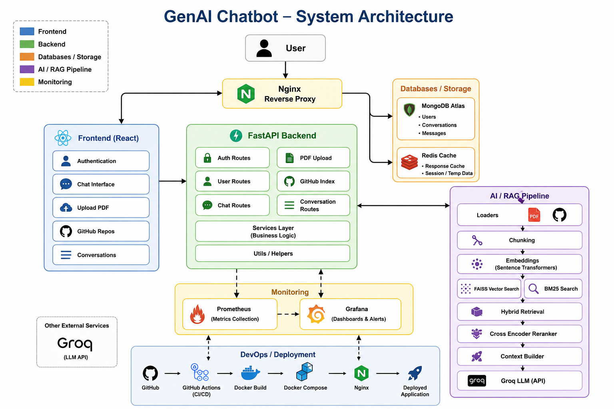
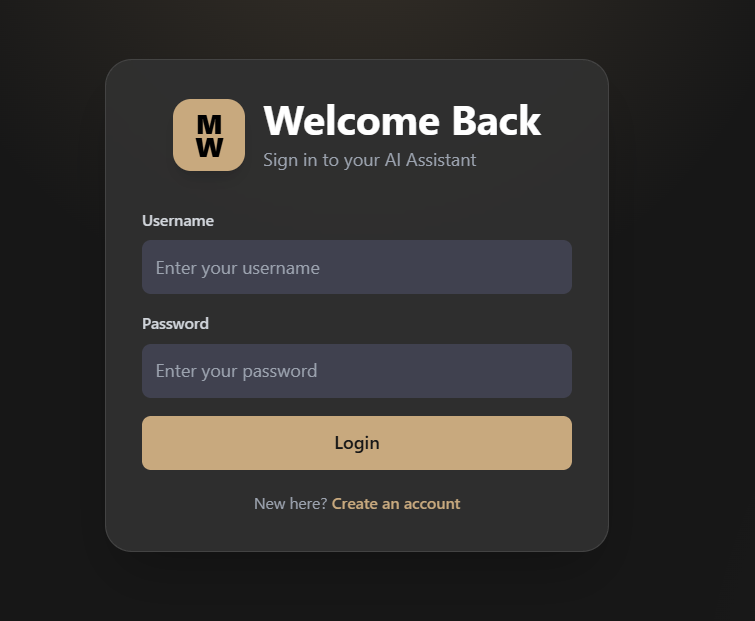
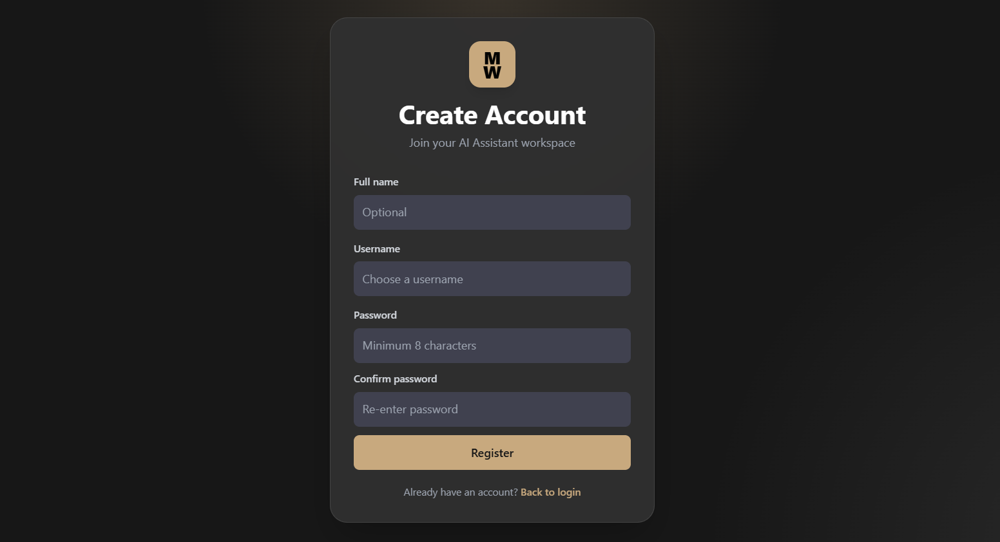
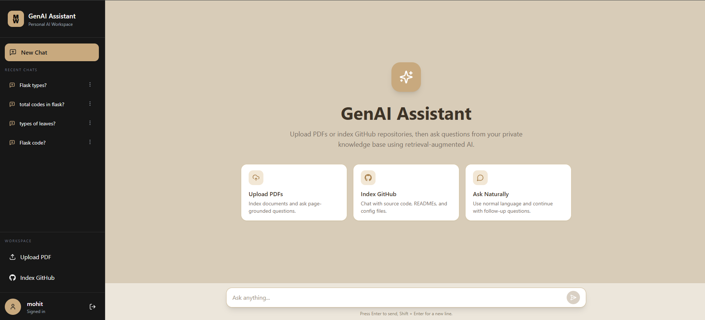
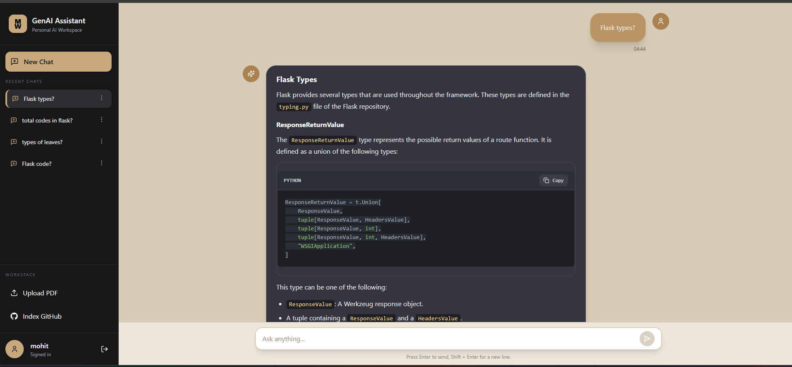
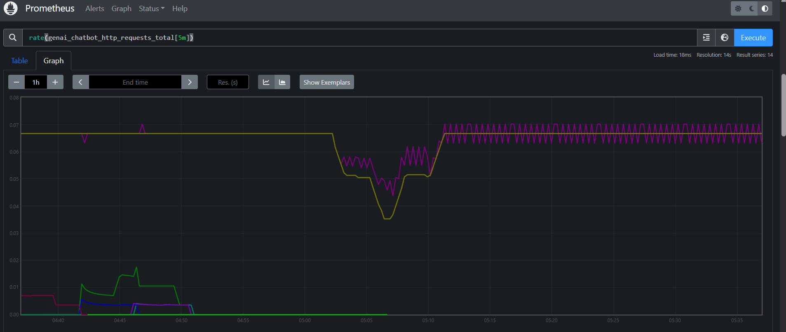
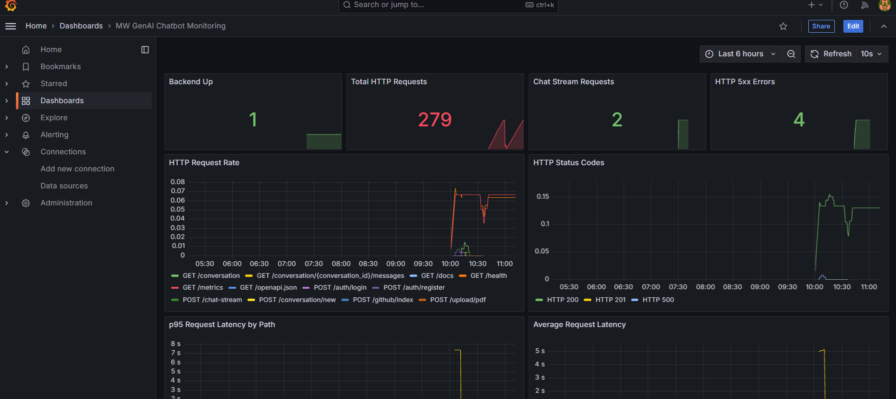

# MW GenAI Chatbot

A production-ready **Retrieval-Augmented Generation chatbot** built with **FastAPI, React, MongoDB Atlas, Redis, FAISS, BM25, Cross-Encoder reranking, Docker, Nginx, Prometheus, Grafana, and Oracle Cloud**.

The application allows authenticated users to upload PDF documents or index public GitHub repositories, then ask questions grounded in those sources using a hybrid RAG pipeline and Groq LLMs.

---

## Live Deployment

| Service | URL |
|---|---|
| Application | http://129.154.247.177 |
| Backend API Docs | http://129.154.247.177/docs |
| Grafana Dashboard | http://129.154.247.177:3001 |
| Prometheus Metrics UI | http://129.154.247.177:9090 |

---

## Architecture




### Authentication

| Login | Register |
|---|---|
|  |  |

### Main Chat Interface



### RAG Response

| |

### Monitoring

| Prometheus | Grafana |
|---|---|
|  |  |


---

## High-Level Flow

1. User accesses the application through **Nginx reverse proxy**.
2. Nginx serves the **React frontend** and routes API requests to the **FastAPI backend**.
3. The backend handles authentication, chat, PDF upload, GitHub indexing, and conversation management.
4. PDF and GitHub content is processed through the RAG pipeline:
   - Loaders
   - Chunking
   - Embeddings
   - FAISS vector search
   - BM25 sparse search
   - Hybrid retrieval
   - Cross-Encoder reranking
   - Context building
5. The final grounded context is sent to the **Groq LLM API** for response generation.
6. Users, conversations, and messages are stored in **MongoDB Atlas**.
7. Response cache and temporary data are handled by **Redis**.
8. Metrics are collected by **Prometheus** and visualized in **Grafana**.

---

## Features

### Authentication

- User registration and login
- JWT-based authentication
- Password hashing with bcrypt
- Protected backend routes
- Protected frontend routes
- Conversation ownership validation

---

### PDF RAG

- Upload and index PDF documents
- Extract text page-by-page using PyMuPDF
- Metadata-rich chunking with page numbers
- FAISS vector indexing
- BM25 sparse retrieval
- Cross-Encoder reranking
- Source attribution with file name and page number
- Multi-PDF chunk persistence

---

### GitHub Repository RAG

- Index public GitHub repositories
- Clone repositories safely
- Skip unsupported, binary, large, and unnecessary files
- Code-aware chunking
- Semantic code search
- Hybrid retrieval over repository content
- Source attribution with repository and file path
- Multi-repository chunk persistence

---

### Hybrid Retrieval Pipeline

The chatbot uses a multi-stage retrieval pipeline instead of relying only on vector search:

1. Dense retrieval using FAISS
2. Sparse retrieval using BM25
3. Result fusion and deduplication
4. Cross-Encoder reranking
5. Context construction for the LLM

This improves retrieval quality and makes answers more grounded in uploaded PDFs or indexed repositories.

---

### Conversation Management

- Persistent chat history
- Multiple conversations per user
- Rename conversations
- Delete conversations
- Conversation-aware follow-up questions
- MongoDB-based message storage

---

### Performance

- Streaming LLM responses
- Redis response caching
- Lazy model loading
- Chunk deduplication
- Optimized FAISS index updates
- Dockerized services
- Nginx reverse proxy

---

### Monitoring and Observability

- Prometheus metrics endpoint
- Grafana dashboard support
- HTTP request metrics
- Chat latency metrics
- Upload and indexing metrics
- Redis cache hit/miss metrics
- Docker health checks
- Structured backend logging

---

## Tech Stack

### Backend

- FastAPI
- Python
- LangChain
- Sentence Transformers
- Cross-Encoder reranking
- FAISS
- BM25
- Groq API
- MongoDB Atlas
- Redis
- PyMuPDF
- JWT authentication

### Frontend

- React
- Vite
- Tailwind CSS
- Axios
- React Router
- React Markdown
- Syntax highlighting

### DevOps and Deployment

- Docker
- Docker Compose
- Nginx reverse proxy
- Prometheus
- Grafana
- Oracle Cloud VM
- Ubuntu Server

---

## Project Structure

```bash
MW-GenAI-Chatbot/
├── app.py
├── config.py
├── requirements.txt
├── Dockerfile
├── docker-compose.yml
├── prometheus.yml
├── README.md
├── assets/
│   ├── architecture.png
│   └── screenshots/
│       ├── 01-login.png
│       ├── 02-register.png
│       ├── 03-chat-dashboard.png
│       ├── 04-pdf-upload.png
│       ├── 05-pdf-rag-response.png
│       ├── 06-github-index.png
│       ├── 07-github-rag-response.png
│       ├── 08-conversation-history.png
│       ├── 09-prometheus.png
│       ├── 10-grafana.png
│       └── 11-docker-containers.png
├── samples/
│   ├── sample.pdf
│   ├── sample2.pdf
│   └── sample_github_repo.txt
├── auth/
├── cache/
├── db/
├── github/
├── rag/
├── routes/
├── services/
├── storage/
├── utils/
├── frontend/
└── nginx/
```

---

## Environment Variables

Create a `.env` file in the project root.

```env
APP_ENV=production

GROQ_API_KEY=your_groq_api_key
GROQ_MODEL=llama-3.1-8b-instant

MONGO_URL=your_mongodb_connection_string
MONGO_DB_NAME=chatbot_db

REDIS_HOST=redis
REDIS_PORT=6379
REDIS_DB=0

SECRET_KEY=replace_with_a_strong_secret_key
ALGORITHM=HS256

CORS_ORIGINS=["http://129.154.247.177","http://localhost","http://localhost:3000","http://localhost:5173"]
```

Do not commit your `.env` file to GitHub.

---

## Local Development

### 1. Clone the repository

```bash
git clone https://github.com/Mohit-Wankhade/MW-GenAI-Chatbot.git
cd MW-GenAI-Chatbot
```

### 2. Start the full stack using Docker Compose

```bash
docker compose up -d --build
```

### 3. Check running containers

```bash
docker compose ps
```

### 4. Open the application locally

| Service | URL |
|---|---|
| Main App through Nginx | http://localhost |
| Frontend container only | http://localhost:3000 |
| Backend API | http://localhost:8000 |
| Swagger Docs | http://localhost:8000/docs |
| Prometheus | http://localhost:9090 |
| Grafana | http://localhost:3001 |

Default Grafana login, if unchanged:

```txt
Username: admin
Password: admin
```

---

## Testing Flow

Before pushing or deploying changes, test the project locally.

### 1. Build containers

```bash
docker compose build
```

### 2. Start containers

```bash
docker compose up -d
```

### 3. Check running containers

```bash
docker compose ps
```

### 4. Check backend health

```bash
curl http://localhost:8000/health
```

Expected response:

```json
{
  "status": "healthy"
}
```

### 5. Check backend logs

```bash
docker compose logs -f backend
```

### 6. Test in browser

Open:

```txt
http://localhost
```

Then test:

- Register user
- Login
- Upload PDF
- Ask PDF-based question
- Index GitHub repository
- Ask code-based question
- Rename conversation
- Delete conversation
- Check Prometheus metrics
- Check Grafana access

### 7. Stop containers

```bash
docker compose down
```

---

## Sample Files

This repository includes two sample PDFs for testing the PDF RAG pipeline and one text file containing sample GitHub repositories.

```txt
samples/sample.pdf
samples/sample2.pdf
samples/sample_github_repo.txt
```

You can upload the PDFs through the application UI to test:

- PDF extraction
- Chunking
- FAISS indexing
- BM25 retrieval
- Cross-Encoder reranking
- Source attribution

You can use `samples/sample_github_repo.txt` to quickly test GitHub repository indexing.

Runtime uploaded files are stored inside `storage/uploads/` and are intentionally ignored from Git.

---

## Oracle Cloud Deployment

Current Oracle Cloud public IP:

```txt
129.154.247.177
```

### 1. SSH into the VM

```bash
ssh -i /path/to/private-key.key ubuntu@129.154.247.177
```

### 2. Clone the repository

```bash
git clone https://github.com/Mohit-Wankhade/MW-GenAI-Chatbot.git
cd MW-GenAI-Chatbot
```

### 3. Create `.env`

```bash
nano .env
```

Add production values:

```env
APP_ENV=production

GROQ_API_KEY=your_groq_api_key
GROQ_MODEL=llama-3.1-8b-instant

MONGO_URL=your_mongodb_connection_string
MONGO_DB_NAME=chatbot_db

REDIS_HOST=redis
REDIS_PORT=6379
REDIS_DB=0

SECRET_KEY=replace_with_a_strong_secret_key
ALGORITHM=HS256

CORS_ORIGINS=["http://129.154.247.177","http://localhost","http://localhost:3000","http://localhost:5173"]
```

### 4. Prepare runtime folders

```bash
mkdir -p storage repos logs
sudo chown -R 1000:1000 storage repos logs
```

### 5. Build and run

```bash
docker compose up -d --build
```

### 6. Check containers

```bash
docker compose ps
```

### 7. Check logs

```bash
docker compose logs -f backend
```

### 8. Access the app

```txt
http://129.154.247.177
```

---

## Oracle Cloud Network Rules

For the demo deployment, the following ports can be opened:

| Port | Purpose |
|---|---|
| 22 | SSH |
| 80 | Main application through Nginx |
| 8000 | Backend API and Swagger docs, optional |
| 3001 | Grafana dashboard, optional |
| 9090 | Prometheus dashboard, optional |

Redis should not be exposed publicly.

| Port | Status |
|---|---|
| 6379 | Internal Docker network only |

For a stricter production setup, expose only:

| Port | Purpose |
|---|---|
| 22 | SSH |
| 80 | Main application |

---

## API Endpoints

### Authentication

| Method | Endpoint | Description |
|---|---|---|
| POST | `/auth/register` | Register a new user |
| POST | `/auth/login` | Login and receive JWT token |
| GET | `/auth/me` | Get current user |

### Chat

| Method | Endpoint | Description |
|---|---|---|
| POST | `/chat-stream` | Stream chatbot response |

### Conversation

| Method | Endpoint | Description |
|---|---|---|
| POST | `/conversation/new` | Create new conversation |
| GET | `/conversation` | List user conversations |
| GET | `/conversation/{id}/messages` | Get messages from a conversation |
| PUT | `/conversation/{id}` | Rename conversation |
| DELETE | `/conversation/{id}` | Delete conversation |

### Upload

| Method | Endpoint | Description |
|---|---|---|
| POST | `/upload/pdf` | Upload and index PDF |

### GitHub

| Method | Endpoint | Description |
|---|---|---|
| POST | `/github/index` | Index public GitHub repository |

### Monitoring

| Method | Endpoint | Description |
|---|---|---|
| GET | `/health` | Health check |
| GET | `/metrics` | Prometheus metrics |

---

## Monitoring

Prometheus scrapes backend metrics from:

```txt
backend:8000/metrics
```

Available metric categories include:

- HTTP requests
- Request latency
- Chat requests
- Chat response time
- PDF uploads
- GitHub repository indexing
- Redis cache hits
- Redis cache misses
- RAG retrieval metrics

Grafana can be used to visualize application and infrastructure metrics.

---

## Security

Implemented security features:

- JWT authentication
- Password hashing
- Protected API routes
- Conversation ownership checks
- File type validation
- Upload size limits
- Safe GitHub URL validation
- Environment-based secrets
- Nginx reverse proxy
- Redis kept internal to Docker network
- Non-root backend Docker container

Recommended future security improvements:

- HTTPS with Let's Encrypt
- Refresh tokens
- Rate limiting
- Role-based access control
- Request audit logs
- Per-user isolated vector indexes
- Document deletion and reindexing

---

## Future Improvements

- HTTPS with custom domain support
- Cleaner Server-Sent Events streaming
- Per-user isolated vector indexes
- Background indexing jobs
- Document deletion and reindexing
- RAG evaluation metrics
- Multi-LLM provider support
- PostgreSQL option
- Kubernetes deployment
- CI/CD deployment pipeline
- Admin dashboard
- Advanced file type support

---

## Resume Highlights

This project demonstrates:

- Full-stack GenAI application development
- Production-grade RAG architecture
- Hybrid search using FAISS and BM25
- Cross-Encoder reranking
- Streaming LLM responses
- Authentication and protected routes
- MongoDB conversation memory
- Redis caching
- Dockerized deployment
- Nginx reverse proxy
- Prometheus and Grafana monitoring
- Oracle Cloud deployment

---

## Author

**Mohit Wankhade**

LinkedIn:  
https://www.linkedin.com/in/mohit-wankhade-a9037b205/

GitHub:  
https://github.com/Mohit-Wankhade